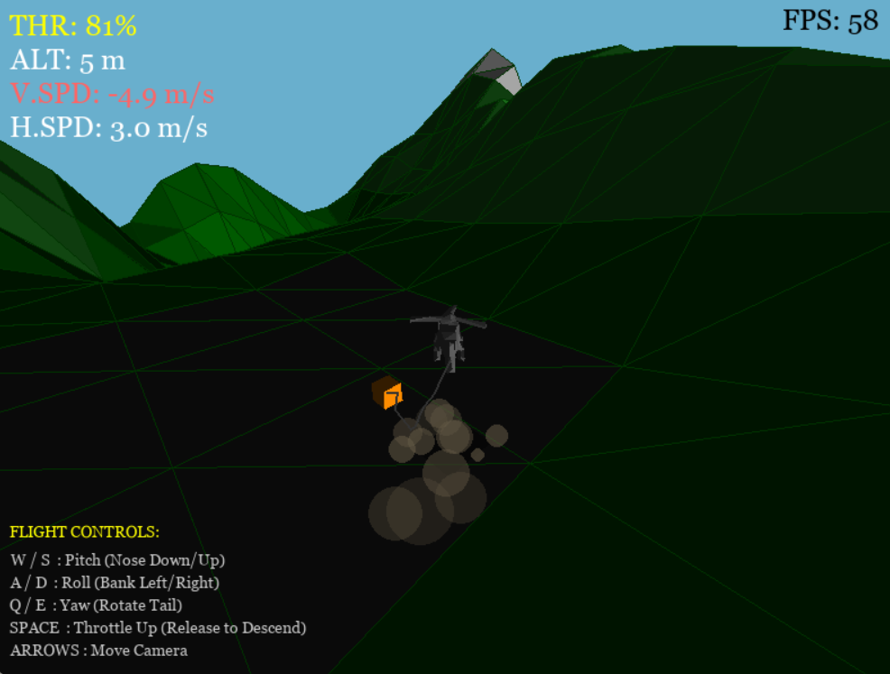

# 3D Helicopter Simultaion



---

## Project Overview
**3D Helicoptor Sim 1** is a custom-built 3D flight simulator and physics engine written in pure Python.

Unlike traditional game projects that rely on Unity or Unreal, this engine constructs a 3D world from scratch using raw math. It implements a full 3D rendering pipeline (projection matrices, clipping, painter's algorithm) and a 6-DOF rigid body physics model for rotorcraft flight dynamics.

The simulation features a multi-body constraint system to simulate heavy-lift operations (sling loading), using Verlet integration to model the flexibility and tension of the connecting cable.

## Key Features

### 1. Custom 3D Graphics Pipeline
* **Math-First Rendering:** No 3D libraries (OpenGL/DirectX) were used. All 3D-to-2D projection, perspective division, and matrix transformations were implemented manually.
* **Visual Fidelity:** Implements "Painter's Algorithm" Z-sorting for correct depth rendering and frustum clipping to handle geometry behind the camera.
* **Volumetrics:** Features a billboard-based particle system for volumetric clouds and rotor wash dust effects that react to helicopter altitude.

### 2. Advanced Physics Simulation
* **6-DOF Flight Model:** The helicopter is not a "floating camera." It is a rigid body with mass, inertia, and drag. Flight is achieved by calculating lift vectors relative to the rotor disc orientation.
* **Verlet Integration (Rope Physics):** The sling load cable is simulated not as a static rod, but as a chain of 10 constrained particles. This allows the rope to slack, whip, and swing realistically based on momentum.
* **Coupled Dynamics:** The heavy cargo crate interacts with the helicopter. If the crate swings wildly, it pulls the aircraft off course, requiring pilot compensation.

### 3. Environmental Interaction
* **Ground Effect:** Lift efficiency increases exponentially when flying close to the terrain, simulated via a radar altimeter check.
* **Procedural Terrain:** Infinite terrain generation using a combination of sine waves to create valleys, peaks, and a flat landing zone.

## Engineering Challenges (My Approach)

**Z-Sorting**

Initially, I struggled with clouds rendering on top of the helicopter even when they were miles away. I implemented a Unified Render Queue that takes every object (Mesh, Cloud, Particle), calculates its distance to the camera, and sorts them every frame before drawing.

**Optimizing Dust**

Rendering 3D geometry in an interpreted language is computationally expensive. I optimized the particle system by implementing a "Dice Roll" spawner—only generating dust 40% of the time instead of every frame—which maintained visual fidelity while saving ~40% of CPU cycles during low-altitude maneuvers.

## Controls
The simulation uses a standard keyboard interface for 4-axis control:

* **W / S:** Pitch (Cyclic Forward/Back)
* **A / D:** Roll (Cyclic Left/Right)
* **Q / E:** Yaw (Turn Left/Right)
* **SPACE:** Throttle
* **UP / DOWN ARROWS:** Pitch Camera (Up and Down)

## How to Run
1.  Ensure you have Python 3.x installed.
2.  Install the dependency:
    ```bash
    pip install pygame
    ```
3.  Run the simulation:
    ```bash
    python Main.py
    ```

---
*Created as part of my Engineering Portfolio series, focusing on the intersection of Aerospace Math and Computer Science.*
